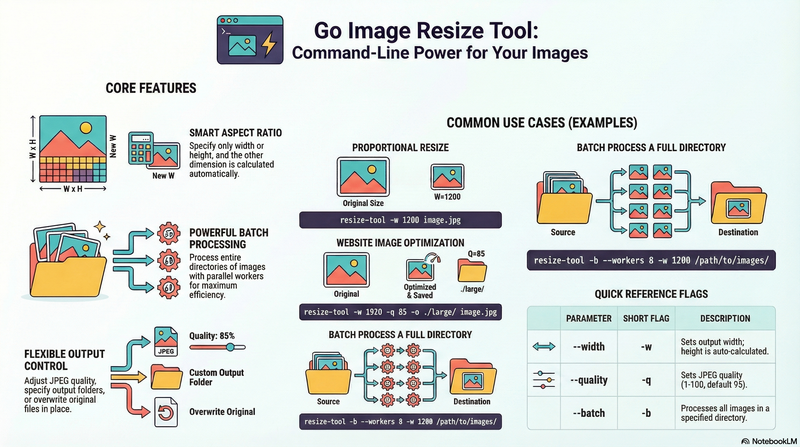

# Go 图片缩放工具

[English](./README.md) | [繁體中文](./README.zh-tw.md) | [简体中文](./README.zh-cn.md)

[](https://github.com/appleboy/resize-tool/actions/workflows/testing.yml)
[](https://github.com/appleboy/resize-tool/actions/workflows/trivy.yml)



一个用 Go 语言开发，简单但功能强大的图片缩放工具。

## 目录

- [Go 图片缩放工具](#go-图片缩放工具)
  - [目录](#目录)
  - [功能特性](#功能特性)
  - [安装方式](#安装方式)
    - [通过脚本安装](#通过脚本安装)
      - [脚本自定义](#脚本自定义)
    - [从源码构建](#从源码构建)
    - [直接使用](#直接使用)
  - [使用说明](#使用说明)
    - [显示帮助](#显示帮助)
    - [基本用法](#基本用法)
    - [CLI 高级用法](#cli-高级用法)
  - [参数说明](#参数说明)
  - [输出文件名格式](#输出文件名格式)
  - [示例](#示例)
    - [1. 批量处理多张图片](#1-批量处理多张图片)
    - [2. 网站图片优化](#2-网站图片优化)
    - [3. 创建缩略图](#3-创建缩略图)
    - [4. 其他实用示例](#4-其他实用示例)
  - [支持的图片格式](#支持的图片格式)
  - [构建说明](#构建说明)
  - [性能提示](#性能提示)
  - [错误处理](#错误处理)
  - [技术细节](#技术细节)
    - [使用的库](#使用的库)
    - [图片处理算法](#图片处理算法)
  - [许可证](#许可证)

## 功能特性

- 支持多种图片格式：JPEG、PNG、GIF、TIFF、BMP
- **🎯 智能等比例缩放**：只指定宽度或高度时，另一边自动等比例计算
- 灵活的缩放选项
- 可选择是否保持宽高比
- 可调节 JPEG 质量
- 支持目录批量处理
- 支持并行处理提升效率
- 可自定义输出目录
- 详细显示进度和文件大小信息

## 安装方式

### 通过脚本安装

你可以使用提供的安装脚本，安装适用于你平台的最新预编译二进制文件：

```bash
curl -fsSL https://raw.githubusercontent.com/appleboy/resize-tool/main/install.sh | bash
```

或使用 wget：

```bash
wget -qO- https://raw.githubusercontent.com/appleboy/resize-tool/main/install.sh | bash
```

默认会安装到 `~/.resize-tool/bin/resize-tool`，并自动添加到 shell 的 PATH。

#### 脚本自定义

你可以通过设置环境变量自定义安装行为：

- `VERSION`：安装指定版本（默认最新发布版）
- `INSTALL_DIR`：更改安装目录（默认：`~/.resize-tool/bin`）
- `CURL_INSECURE=true`：允许不安全的 SSL 下载（不推荐）

示例：

```bash
INSTALL_DIR="$HOME/bin" VERSION="1.2.3" bash <(curl -fsSL https://raw.githubusercontent.com/appleboy/resize-tool/main/install.sh)
```

安装完成后，请重启终端或执行 `source ~/.bashrc`（或你的 shell 配置文件）以更新 PATH。

### 从源码构建

```bash
git clone <your-repo>
cd resize-tool
go mod tidy
go build -o resize-tool .
```

### 直接使用

如果你已经有编译好的二进制文件，可以直接使用：

```bash
resize-tool [选项] <图片文件>
```

## 使用说明

### 显示帮助

```bash
resize-tool --help
```

### 基本用法

```bash
# 默认缩放为 800x600 像素
resize-tool image.jpg

# 🎯 只指定宽度，高度自动等比例计算（推荐）
resize-tool -w 1200 image.jpg

# 🎯 只指定高度，宽度自动等比例计算（推荐）
resize-tool --height 800 image.jpg

# 指定精确尺寸（可能会变形）
resize-tool -w 1200 --height 800 image.jpg

# 指定尺寸并保持宽高比（缩放至指定范围内）
resize-tool -k -w 1200 --height 800 image.jpg
```

### CLI 高级用法

```bash
# 设置 JPEG 质量（1-100）
resize-tool -q 85 -w 1000 image.jpg

# 指定输出目录
resize-tool -w 800 -o ./resized/ image.jpg

# 覆盖原始文件（不生成带尺寸的新文件名）
resize-tool -w 800 --overwrite image.jpg

# 批量处理目录下所有图片
resize-tool -b -w 1200 /path/to/image/directory

# 批量处理并覆盖原始文件
resize-tool -b -w 1200 --overwrite /path/to/image/directory

# 批量处理时使用多线程
resize-tool -b --workers 8 -w 1920 /path/to/image/directory

# 详细输出模式
resize-tool -v -w 800 image.jpg

# 组合多个选项
resize-tool -w 1920 --height 1080 -q 90 -o ./output/ -k -v image.jpg
```

## 参数说明

| 参数           | 简写 | 默认值 | 说明                                 |
| -------------- | ---- | ------ | ------------------------------------ |
| `--width`      | `-w` | 0      | 输出宽度（像素，0=根据高度自动计算） |
| `--height`     |      | 0      | 输出高度（像素，0=根据宽度自动计算） |
| `--quality`    | `-q` | 95     | JPEG 质量（1-100）                   |
| `--output`     | `-o` | 同输入 | 输出目录（默认与输入相同）           |
| `--keep-ratio` | `-k` | false  | 同时指定宽高时，是否保持宽高比       |
| `--batch`      | `-b` | false  | 批量处理目录下所有图片               |
| `--workers`    |      | 4      | 批量处理时的并行线程数               |
| `--verbose`    | `-v` | false  | 启用详细输出                         |
| `--overwrite`  |      | false  | 覆盖原始文件，不创建新文件           |
| `--help`       | `-h` |        | 显示帮助信息                         |

## 输出文件名格式

缩放后的文件会自动包含尺寸信息：

- 原始文件：`photo.jpg`
- 输出文件：`photo_800x600.jpg`

**注意**：使用 `--overwrite` 时，会直接替换原始文件，不会添加尺寸后缀。

## 示例

### 1. 批量处理多张图片

```bash
# 处理当前目录下所有 jpg 文件
for img in *.jpg; do
    ./resize-tool -w 1200 "$img"
done
```

```bash
# 处理当前目录下所有 png 文件（仅指定高度）
for img in *.png; do
    ./resize-tool --height 800 "$img"
done
```

### 2. 网站图片优化

```bash
# 创建三种不同尺寸（智能等比例缩放）
./resize-tool -w 1920 -q 85 -o ./large/ image.jpg
./resize-tool -w 1200 -q 85 -o ./medium/ image.jpg
./resize-tool -w 600 -q 80 -o ./small/ image.jpg
```

### 3. 创建缩略图

```bash
# 创建正方形缩略图（固定尺寸，可能会裁剪）
./resize-tool -w 300 --height 300 -o ./thumbnails/ image.jpg

# 创建缩略图（保持宽高比，最大 300x300）
./resize-tool -w 300 --height 300 -k -o ./thumbnails/ image.jpg
```

### 4. 其他实用示例

```bash
# 只指定宽度，高度自动计算
./resize-tool -w 1200 image.jpg

# 只指定高度，宽度自动计算
./resize-tool --height 800 image.jpg

# 同时指定宽高（可能会变形）
./resize-tool -w 1200 --height 800 image.jpg

# 同时指定宽高并保持宽高比（缩放至范围内）
./resize-tool -k -w 1200 --height 800 image.jpg

# 设置 JPEG 质量
./resize-tool -q 85 -w 1000 image.jpg

# 指定输出目录
./resize-tool -w 800 -o ./resized/ image.jpg

# 覆盖原始文件（直接替换）
./resize-tool -w 800 --overwrite image.jpg

# 批量处理目录下所有图片
./resize-tool -b -w 1200 /path/to/image/directory

# 批量处理并覆盖原始文件
./resize-tool -b -w 1200 --overwrite /path/to/image/directory

# 批量处理并使用多线程
./resize-tool -b --workers 8 -w 1920 /path/to/image/directory

# 详细输出模式
./resize-tool -v -w 800 image.jpg

# 组合多个选项（注意：--overwrite 不能与 --output 同时使用）
./resize-tool -w 1920 --height 1080 -q 90 -o ./output/ -k -v image.jpg
```

## 支持的图片格式

- **输入格式**：JPEG、PNG、GIF、TIFF、BMP
- **输出格式**：与输入格式相同

## 构建说明

如需从源码构建：

```bash
go build -o resize-tool .
```

跨平台构建（多平台）：

```bash
make release  # 构建多平台二进制文件
```

## 性能提示

- 使用 Lanczos 算法进行高质量图片缩放
- 处理大文件时可能需要更多内存
- JPEG 质量设置会影响文件大小和图片质量

## 错误处理

本工具会自动处理常见错误情况：

- 找不到文件
- 不支持的图片格式
- 输出目录创建失败
- 内存不足

## 技术细节

### 使用的库

- `github.com/disintegration/imaging` - 图片处理
- `github.com/spf13/cobra` - CLI 界面

### 图片处理算法

- **缩放算法**：Lanczos（高质量）
- **宽高比保持**：使用 Fit 方法，将图片缩放至指定范围内
- **强制尺寸**：使用 Resize 方法，可能会改变宽高比

## 许可证

MIT License
